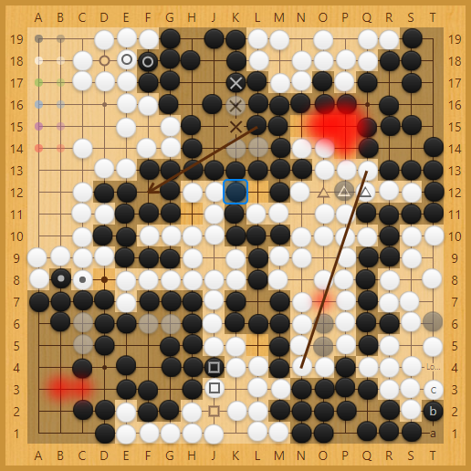

# Shudan Goban

A highly customizable Preact Goban component. This is a work in progress.

## Features

- Easy customization
- Fuzzy stone placement
- Stone placing animation
- Lines and arrows
- Heat & paint map
- Busy state
- Show only part of board

## Installation

Use npm to install:

~~~
$ npm install @sabaki/shudan-goban
~~~

To use this module, require it as follows:

~~~js
const {h} = require('preact')
const Shudan = require('@sabaki/shudan-goban')

const CustomComponent = props => (
    <Shudan
        vertexSize={24}
        signMap={props.signMap}
    />
)
~~~

We assume you have a bundler set up correctly and Preact installed.

