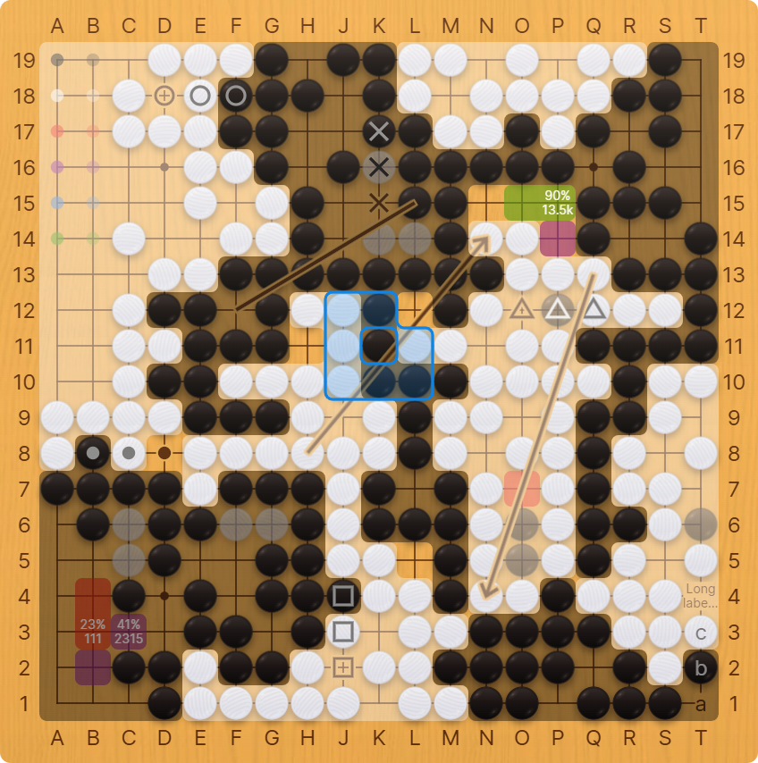

# Shudan Goban

A highly customizable, low-level Goban web component.

Shudan is a web component library for rendering Go boards. It provides a
flexible and customizable goban component with support for multiple layers,
including stones, markers, labels, and more.



## Features

- 📐 Resizable with SVG
- ⌨️ Keyboard accessibility
- 🔠 Board coordinates
- ✒️ Easy to author
- 🎛️ Customizable
- 🧱 Flexible layer system
- 🧩 Partial board support

## Quick Start

Import library and use the web components directly in your HTML. A minimal setup
looks like follows:

```html
<script type="module" src="./path/to/shudan.js"></script>

<shudan-goban coords width="9" height="9">
  <shudan-grid-layer></shudan-grid-layer>
  <shudan-stone-layer stones='{ "C3": 1, "G7": -1 }'></shudan-stone-layer>
</shudan-goban>
```

Alternatively, components can be constructed programmatically:

```ts
import { Goban, GridLayer, StoneLayer } from "@sabaki/shudan";

const goban = new Goban();
goban.width = 9;
goban.height = 9;
goban.coords = true;

const stoneLayer = new StoneLayer();
stoneLayer.stones = { C3: 1, G7: -1 };

goban.append(new GridLayer(), stoneLayer);
document.body.append(goban);
```

## Documentation

See [documentation](./docs/README.md).
